# Blender MCP + AI AGNO Multi-Agent Production Studio

## Overview

This project implements a sophisticated, multi-agent system for controlling Blender using natural language. It leverages the Blender MCP (Multi-Process Communication) addon and the AGNO Agent framework, powered by Google Gemini models. This system orchestrates a team of 17 specialized AI agents to manage a complete 3D production pipeline, from concept to final render, within Blender.

The system connects Blender to a **Coordinator Agent** that manages a team of specialist agents. Each agent is responsible for a specific part of the 3D production workflow, such as scriptwriting, concept art, 3D modeling, texturing, rigging, animation, lighting, rendering, and quality assurance. This allows for complex, multi-step 3D asset creation and scene generation through conversational AI.

## Features

- **Multi-Agent Orchestration**: A Coordinator agent manages a team of 17 specialist AI agents for a full 3D production pipeline.
- **Natural Language Control**: Interact with the entire production team using conversational language directed at the Coordinator.
- **Persistent Chat History & Memory**: All conversations and key decisions are saved for session continuity and learning.
- **Session Management**: Create and manage multiple production sessions.
- **Automated 3D Asset Creation**: From textual descriptions and creative specifications, agents generate Blender Python scripts (primarily using `bmesh`) to create 3D models.
- **Detailed Production Workflow**: Covers script & narrative, concept art (including AI-generated image prompts), storyboarding, 3D modeling, UV unwrapping, texturing, rigging, animation, environment setup, lighting, camera work, rendering, and QA.
- **Asset Integration**: Includes capabilities for downloading and importing assets from Poly Haven.
- **AI-Generated Concept Images**: The Coordinator can generate initial concept images to guide the creative team.
- **Custom Material Creation**: Agents can create and apply PBR materials.
- **Blender Python Script Execution**: The system relies on generating and executing Blender Python scripts for most operations.

## Demo

[Link to Your Demo Video Here - e.g., Watch the demo video of the multi-agent studio in action!]

## Setup and Installation

### Prerequisites

- Blender: Version 3.0 or newer (ensure it's compatible with the MCP addon version).
- Python: Version 3.10 or newer.
- `uv` package manager:
  - Mac: `brew install uv`
  - Windows: `powershell -c "irm https://astral.sh/uv/install.ps1 | iex"` then add `C:\Users\YOUR_USERNAME\.local\bin` to your PATH.
  - For other platforms, follow the instructions on the [uv installation page](https
    ://astral.sh/uv#installation).
  - ⚠️ **Do not proceed before installing `uv`**.

### Installing the Blender MCP Addon

1. Download the `addon.py` file (or the latest version of the MCP addon compatible with this project) from this repository or its source.
2. Open Blender.
3. Go to `Edit > Preferences > Add-ons`.
4. Click "Install..." and select the `addon.py` file.
5. Enable the addon by checking the box next to "Interface: Blender MCP".

### Setting Up the AGNO Agent Studio

1. Clone this repository:
   ```bash
   git clone https://github.com/yourusername/blender-mcp-agent.git
   cd blender-mcp-agent
   ```
2. Install the required Python packages:
   ```bash
   pip install -r requirements.txt
   ```
3. Set up your environment variables:
   * Create a `.env` file in the root of the project.
   * Add your `GEMINI_API_KEY` and `UVX_PATH` (path to your `uvx.exe` or `uvx` binary).
     ```env
     GEMINI_API_KEY="YOUR_API_KEY_HERE"
     UVX_PATH="C:/path/to/your/uvx.exe" # or /path/to/your/uvx for Linux/Mac
     # Optional: Override default model IDs if needed
     # MODEL_TEAM_COORDINATOR="gemini-1.5-pro-latest"
     # ... other model configs ...
     ```

## How It Works

The system uses a sophisticated architecture:

1. **Blender MCP Addon**: Runs inside Blender, acting as a server that exposes Blender's functionality via the MCP protocol (typically on port 9876).
2. **MCP Client (via `uvx blender-mcp`)**: The Python application (`appF.py`) launches and connects to the Blender MCP server, establishing a communication channel.
3. **AGNO Multi-Agent Team**:
   * Powered by Google Gemini models.
   * A **Coordinator Agent** is the primary interface for the user.
   * The Coordinator manages a team of **17 specialized agents**. Each agent has a specific role (e.g., Script & Narrative, Concept Artist, Python Code Synthesis Specialist, Modeling Specialist, etc.) and a tailored set of instructions and tools.
   * The team operates in **"coordinate" mode**, where the Coordinator delegates tasks to specialist members, gathers their outputs, and orchestrates the overall production workflow.
4. **Workflow Automation**:
   * The Coordinator receives a user request.
   * It guides creative agents to produce detailed specifications (scripts, concept art, storyboards). Concept Artists can also request AI-generated images via the Coordinator.
   * These specifications are passed to the Python Code Synthesis Specialist, which generates Blender Python scripts (primarily using `bmesh`).
   * The Modeling Specialist (or Technical Director) executes these scripts in Blender via MCP.
   * Subsequent tasks like texturing, rigging, animation, etc., are delegated to the respective specialists.
5. **Persistence**: The system uses SQLite databases to maintain chat history (session data) and agent memories, allowing for complex, multi-step tasks and session continuity.

## Multi-Agent Workflow

The 17-agent team operates in a structured, sequential pipeline orchestrated by the Coordinator. Here's a high-level overview:

1. **User Request & Initial Setup**:
   * User provides a task to the Coordinator.
   * Coordinator consults with Management (Executive Producer, Production Director) for high-level approval/planning.
   * Coordinator may generate an initial concept image using `generate_image_from_text_concept`.
2. **Creative Development & Specification**:
   * **Script & Narrative Agent**: Creates a detailed script with asset names, geometric descriptions, material intent, and spatial relationships.
   * **Concept Artist Agent**: Based on the script and any generated images, creates visual concepts, style guides, color palettes, suggests image prompts for the Coordinator to generate more specific visuals, and attempts preliminary `bmesh` script snippets.
   * **Storyboard Artist Agent**: Creates storyboards and a detailed shot list with camera plans based on the script and concept art.
3. **Code Synthesis**:
   * **Coordinator**: Compiles all specifications from the creative tier.
   * **Python Code Synthesis Specialist**: Receives compiled specs (including preliminary `bmesh` code and image references) and generates the final, robust Blender Python script for asset creation, performing mandatory self-correction for Python syntax.
4. **Asset Creation & Initial Modeling**:
   * **Modeling Specialist**: Executes the script from the Python Code Synthesis Specialist using `execute_blender_code`. Reports success or errors.
   * **Coordinator/Technical Director**: If errors occur (especially syntax errors like `null`), the script is sent back to the Python Code Synthesis Specialist for correction, or the Technical Director assists in debugging.
5. **Pipeline Progression (Sequential Delegation by Coordinator)**:
   * **UV Unwrapping** (Modeling Specialist)
   * **Texturing & Materials**
   * **Rigging & Animation** (Rigging part)
   * **Environment & Scene Assembly**
   * **Lighting**
   * **Camera & Cinematography**
   * **Animation** (Animation part for rigged assets)
6. **Quality Assurance**:
   * **Technical QA Agent**: Validates assets/scenes technically.
   * **Artistic QA Agent**: Evaluates artistic quality against references.
   * Coordinator manages revisions based on QA feedback.
7. **Rendering & Final Output**:
   * **Rendering & Compositing Agent**: Configures render settings and produces the final output.
8. **Project Closure/Iteration**:
   * Production Assistant handles archival.
   * Coordinator presents results to the user.

### Workflow Diagram (Mermaid)

```mermaid
graph TD
    A[User Request] --> B(Coordinator);

    subgraph Management Tier
        C[Executive Producer]
        D[Production Director]
    end

    B --> |Inform/Consult| C;
    B --> |Inform/Consult| D;
    B --> |Optional Initial Image Generation| E[Generate Image Concept Tool];

    subgraph Creative Development
        F[Script & Narrative Agent]
        G[Concept Artist Agent]
        H[Storyboard Artist Agent]
    end

    B --> |Task: Scripting| F;
    F -- Script & Asset Specs --> B;
    B --> |"Task: Visuals & Prelim. BMesh (can provide image prompts)"| G;
    G -- "Concept Art, Prelim. BMesh, Image Prompts" --> B;
    B -.-> |"If G provides prompts"| E;
    E -- "Generated Images for Concept Artist" --> G;
    E -- "Generated Images for Coordinator/Team" --> B;
    B --> |Task: Storyboards| H;
    H -- "Shot List & Storyboards" --> B;

    B --> |Compile All Specs| I[Python Code Synthesis Specialist];
    I -- Final Blender Python Script --> B;

    subgraph Execution & Iteration
        J[Modeling Specialist]
        K[Technical Director]
    end

    B --> |Execute Script Task| J;
    J -- "Script Execution Report (Success/Error)" --> B;
    B -- "If Basic Syntax Error (e.g., null)" --> I;
    B -- "If Other Script Error" --> K;
    K -- "Debugging Aid/Analysis" --> B;

    subgraph Production Pipeline Specialists
        L[Texturing & Materials]
        M[Rigging & Animation]
        N[Environment & Scene Assembly]
        O[Lighting Specialist]
        P[Camera & Cinematography]
        Q[Rendering & Compositing]
    end

    B --> |"Task: UVs (to J)"| J;
    B --> |Task: Texturing| L;
    B --> |Task: Rigging| M;
    B --> |Task: Scene Assembly| N;
    B --> |Task: Lighting| O;
    B --> |Task: Camera Setup| P;
    B --> |"Task: Animation (to M)"| M;
  
    subgraph Quality Assurance
        R[Technical QA Agent]
        S[Artistic QA Agent]
    end

    B --> |Task: Technical QA| R;
    B --> |Task: Artistic QA| S;
    R -- QA Report --> B;
    S -- QA Report --> B;
  
    B -.-> |"Iterate/Revise (if QA fails)"| I;
    B -.-> |"Iterate/Revise (if QA fails)"| J;
    B -.-> |"Iterate/Revise (if QA fails)"| L;
    B -.-> |"Iterate/Revise (if QA fails)"| M;
    %% Add more iteration lines to other specialists as needed based on QA results

    B --> |Task: Final Rendering| Q;
    Q -- Final Output --> B;
    B --> T[User/Final Delivery];
  
    U[Production Assistant] <--> |Admin & Logistics| B;
```




Usage

### Starting the Connection

* **In Blender, go to the 3D View sidebar (press** **N** **if not visible).**
* **Find the "BlenderMCP" tab.**
* **Ensure the MCP server is active (often starts automatically or via a button in the addon).**
* **Turn on the Poly Haven checkbox if you want assets from their API (optional).**

### Running the AGNO Agent Studio

* **Make sure Blender is running with the MCP addon activated and the server is listening.**
* **Navigate to the project directory in your terminal.**
* **Run the main application script (e.g.,** **appF.py**):

  ```
  python appF.py
  ```

  **You can also provide an initial task:**

  ```
  python appF.py -m "Create a short animation of a character waving hello in a park."
  ```

  **Or continue a session:**

  ```
  python appF.py -s "bls_xxxxxxxxxxxxxx"
  ```
* **The script will check for an active MCP server (default port 9876).**
* **The Coordinator agent will then take your initial task and begin orchestrating the team.**

### Example Interaction (with Coordinator)

* **User: "I need a 3D model of a futuristic sci-fi crate, weathered and metallic, suitable for a game environment."**
* **Coordinator (after internal delegation): "Okay, I've tasked the Script & Narrative agent to define the asset 'SciFi_Crate_01' with detailed geometric and material notes..."**
* **(Coordinator continues to manage the pipeline, providing updates)**

## Contributing

**Contributions are welcome! Please feel free to submit a Pull Request.**

* **Fork the repository.**
* **Create your feature branch (**git checkout -b feature/amazing-feature**).**
* **Commit your changes (**git commit -m 'Add some amazing feature'**).**
* **Push to the branch (**git push origin feature/amazing-feature**).**
* **Open a Pull Request.**

## License

**This project is licensed under the MIT License - see the** **LICENSE** **file for details.**

## Acknowledgments

* **Blender Foundation for the amazing 3D software.**
* **Google for the Gemini AI models.**
* **Poly Haven for the 3D assets.**
* **The AGNO framework developers.**
* **The MCP protocol developers.**

## Contact

**Richardson Gunde**

* **GitHub:** [yourusername](https://www.google.com/url?sa=E&q=https%3A%2F%2Fgithub.com%2Fyourusername)
* **YouTube Demo: [Link to your YouTube demo]**
* **LinkedIn: [Your LinkedIn Profile URL]**

---
